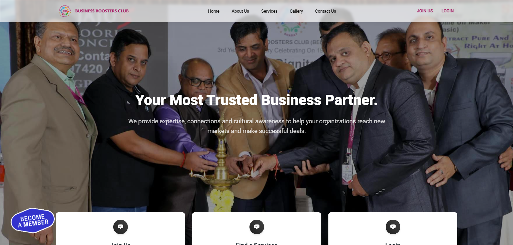
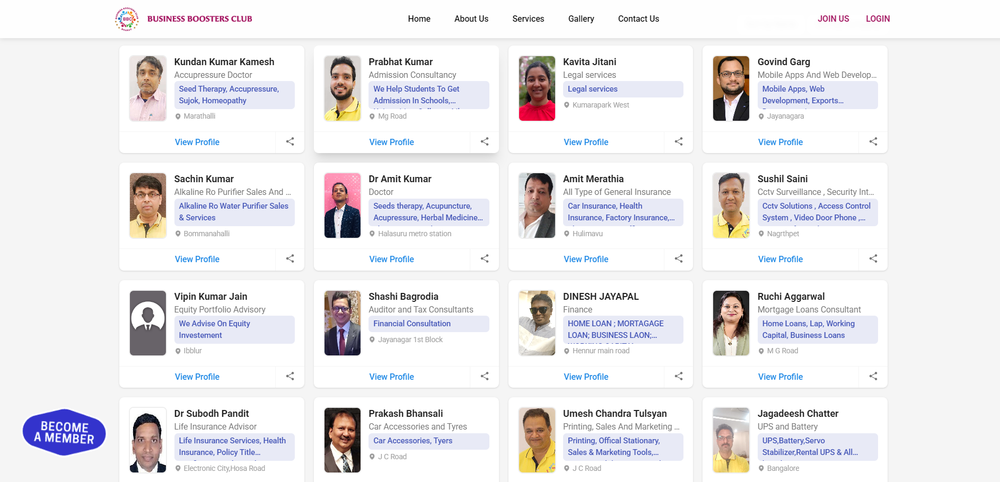
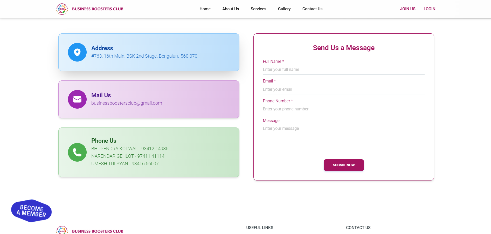

# BBC WEBSITE


_A modern and responsive web application built with React, Vite, and Tailwind CSS._

---

## 🚀 Project Overview
The **BBC WEBSITE** is a dynamic and interactive web application designed to deliver a seamless user experience. Built using modern web technologies, it ensures high performance, responsiveness, and scalability.

## 🔥 Features
- 📌 **Fast & Lightweight** - Powered by Vite for instant builds and rapid development.
- 🎨 **Modern UI** - Styled with Tailwind CSS and Material Tailwind.
- 📱 **Fully Responsive** - Optimized for all devices.
- 🔄 **Dynamic Routing** - Managed using React Router.
- 📰 **Live News Integration** - Fetches real-time news using external APIs.
- 🖼️ **Image Gallery** - Interactive media display with `react-slick`.
- 💾 **Data Management** - Efficient API handling with Axios.
- ⚡ **Smooth Animations** - Powered by Framer Motion.

---

## 📂 Project Structure
```
ag-solutions-bangalore-bbc-new-website/
├── README.md
├── index.html
├── package.json
├── vite.config.js
├── tailwind.config.cjs
├── public/
│   ├── css/
│   │   └── tailwind.css
│   ├── images/
│   ├── stories/
└── src/
    ├── App.jsx
    ├── main.jsx
    ├── routes.jsx
    ├── pages/
    ├── data/
    ├── widgets/
    ├── layout/
```

---

## 🛠️ Tech Stack
- **Frontend:** React, Vite, Tailwind CSS, Material Tailwind
- **State Management:** React Context API
- **Animations:** Framer Motion
- **API Calls:** Axios
- **Routing:** React Router DOM

---

## 📸 Screenshots
### 🏠 Home Page


### Service Page 🛠️


### 📞 Contact Page ✉️


---

## ⚙️ Installation & Setup
### Prerequisites
Ensure you have the following installed:
- [Node.js](https://nodejs.org/) (LTS version recommended)
- [Git](https://git-scm.com/)

### Clone the Repository
```sh
git clone https://github.com/yourusername/bbc-website.git
cd bbc-website
```

### Install Dependencies
```sh
npm install
```

### Run Development Server
```sh
npm run dev
```
Open `http://localhost:5173/` in your browser.

### Build for Production
```sh
npm run build
```

---

## 💡 Contributing
We welcome contributions! Feel free to open issues and submit pull requests.

---

## 📜 License
This project is licensed under the **MIT License**.

---

📩 **Need Help?** Contact us at `https://ag-solutions.in/contact.php` or open an issue on GitHub! 🚀

